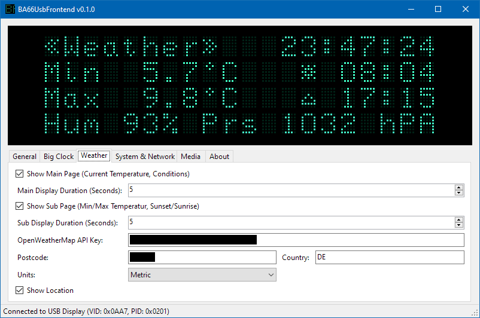

# BA66UsbFrontend

C# .NET utility application for **Wincor Nixdorf BA66 USB** 4x20 character point-of-sale VFDs. Supports displaying date/time, weather (via [OpenWeatherMap API](https://openweathermap.org/api)), some system and network stats, and media playback status (via [beefweb plugin](https://www.foobar2000.org/components/view/foo_beefweb) for [foobar2000](https://www.foobar2000.org/)), and additionally simulates the VFD output in the UI.

Code uses [Device.Net](https://github.com/MelbourneDeveloper/Device.Net) and friends for USB communications, and should hopefully be clear enough to (in conjunction with the manuals) understand how to interface with the display over USB.

## Documentation
- [BA66 USB Cashier Display Product Manual, June 2004](Docs/BA66_USB_Display_Operating_Manual_english.pdf)
- [BA6x Cashier Display Character Sets Appendix, 2008](Docs/BA6x_Character_Appendix_english.pdf)

## Notes
- My BA66 came with a **USB Type-B to PoweredUSB** cable attached, but [PoweredUSB](https://en.wikipedia.org/wiki/PoweredUSB) is not required to drive the display and, as the label implies (+5V, 450 mA), it works fine with a normal Type-B to Type-A cable.
- Adapting the project for use with the **BA63 USB** (2x20 characters, USB PID 0x0200) is possible, but all data sent to the display is formatted for four lines, so all screen layouts will need reworking, etc.

## Screenshots

